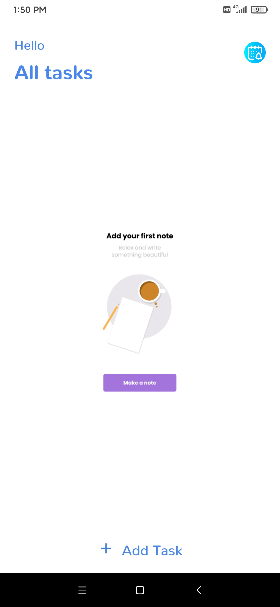
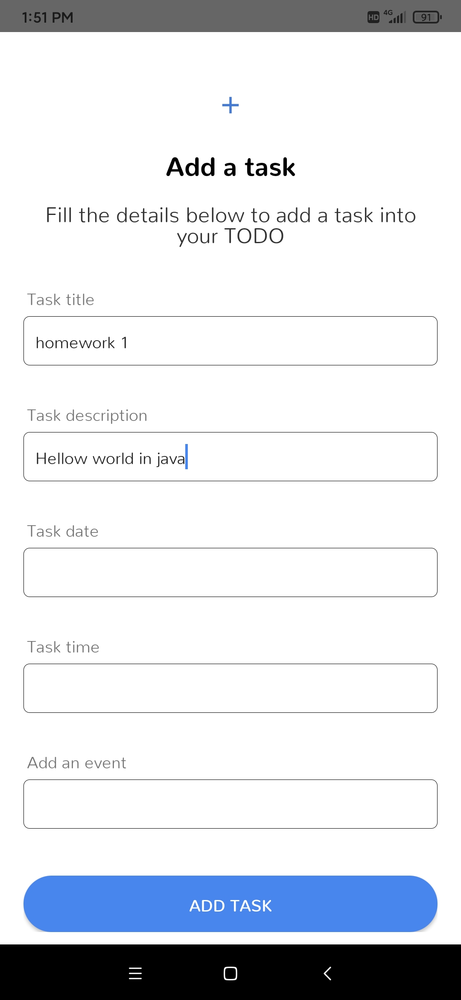
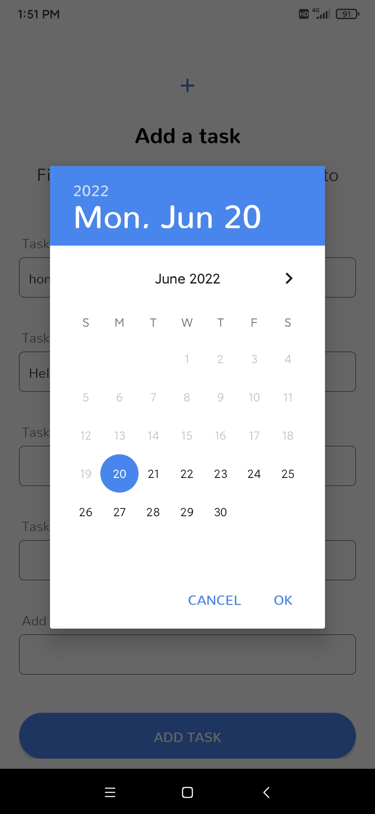
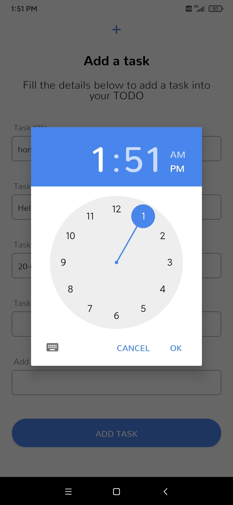
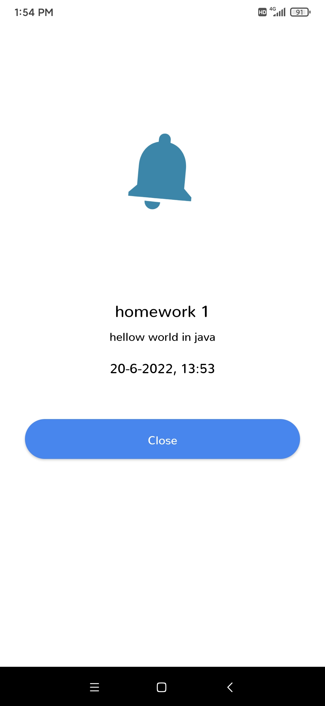
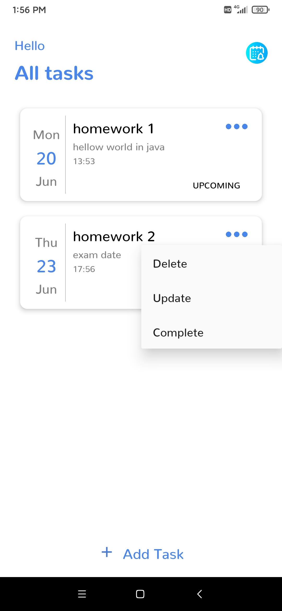
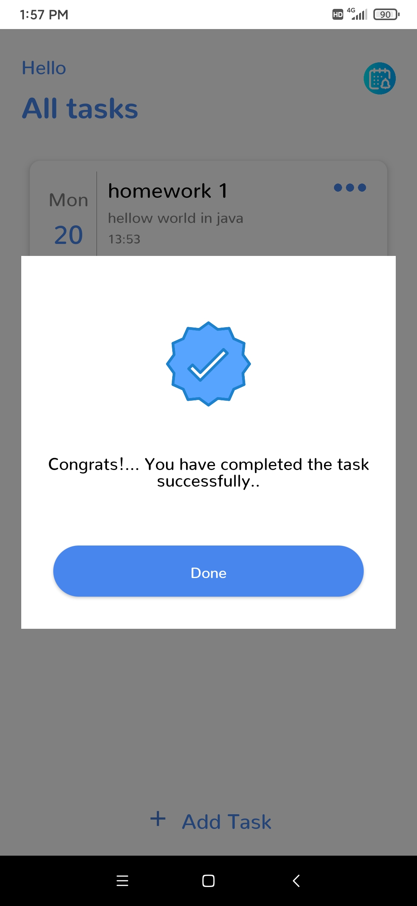

# Advance-To-Do-App
Advance To Do App in (java )Android studio 

You can add your todo list into the app set the time for it you will get reminder on the exact time. You can check the list as well as complete mark the list as complete once a task is been completed, delete the task if it is no required, edit it to make changes in the date, time, title etc. 

An other option is the calendar and you can have an overview of all the task in a concise view.

# Tech Stack
- Androidx
- Calligraphy for fonts
- Butterknife for binding the ids
- Room database
- Glide
- Calendar View

# Download

Download [APK](https://github.com/naemazam/Advance-To-Do-App/raw/main/ToDo.apk.1) file and install it on your android phone

# ScreenShot 

